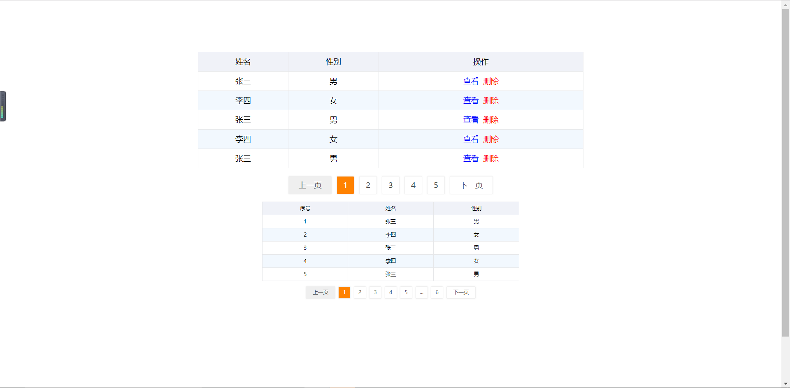

# 示例



# 插件说明

## css 兼容性

> .css 兼容 ie8 以上
> .less （方便调样式）

## js 兼容性

> 兼容 ie8 以上

## 扩展性

> 样式可自行扩展
> js 可以自行扩展

## 迁移

> 此插件使用原生 js 不依赖任何插件

# 配置属性

### page 属性

| Name       |   type   |             descriptor              |   default | required |
| ---------- | :------: | :---------------------------------: | --------: | :------: |
| index      | integer  |               当前页                |         1 |    no    |
| count      | integer  |             一页多少行              |         5 |    no    |
| nums       | integer  |               页码数                |         5 |    no    |
| pContainer |  string  |             容器选择器              | undefined |   yes    |
| pId        |  stirng  | 分页 id 名称（非选择器） 多分页必填 | undefined |    no    |
| ellipsis   |  string  |             分页省略号              | undefined |    no    |
| pZoom      |  float   |              缩放系数               |         1 |    no    |
| pSkip      | interger |               跳转页                |     false |    no    |

### table 属性

| Name       |  type  |             descriptor              |   default | required |
| ---------- | :----: | :---------------------------------: | --------: | :------: |
| names      | array  |                表头                 | undefined |   yes    |
| tContainer | string |             容器选择器              | undefined |   yes    |
| tId        | stirng | 表格 id 名称（非选择器） 多表格必填 | undefined |    no    |
| tZoom      | float  |              缩放系数               |         1 |    no    |

#### names

| Name   |   type   | descriptor |   default | required |
| ------ | :------: | :--------: | --------: | :------: |
| field  |  string  |    字段    | undefined |   yes    |
| name   |  string  |  字段名称  | undefined |   yes    |
| hidden | boolean  |  隐藏字段  | undefined |    no    |
| sort   |   any    |  排序模式  | undefined |    no    |
| up     | function |    升序    | undefined |    no    |
| down   | function |    降序    | undefined |    no    |
| format | function |   格式化   | undefined |    no    |

### common 公共属性

| Name       |  type   | descriptor | default | required |
| ---------- | :-----: | :--------: | ------: | :------: |
| adapterCss | boolean |  适配模式  |      no |    no    |

# API

### 核心方法

| Name              |     Parameter      |    Return     |                        Description |
| ----------------- | :----------------: | :-----------: | ---------------------------------: |
| load([,pageData]) |   {index,count}    |               |                   加载数据渲染数据 |
| pageData([,page]) |   {index,count}    | {index,count} | 获取分页以及传入参数自定义获取分页 |
| renderPage(data)  | {index,rows,pages} |               |                           渲染分页 |
| renderData(data)  |      {datas}       |               |                           渲染表格 |
| pHide()           |                    |               |                           隐藏分页 |
| tHide()           |                    |               |                           隐藏表格 |
| dead()            |                    |               |                           销毁表格 |

### 扩展外部方法

| Name                   |   Parameter   |             Return             |                                  Description |
| ---------------------- | :-----------: | :----------------------------: | -------------------------------------------: |
| allData(data,pageData) | Object,Object | {datas,index,count,rows,pages} | 如果后台返回的是全部数据，可以使用此方法处理 |

### 内部方法

| Name                    | Parameter | Return |                                 Description |
| ----------------------- | :-------: | :----: | ------------------------------------------: |
| isUOrN(value)           |    any    |  any   | 如果数据是 undefined 或者 null 那么转换成'' |
| PKit_inset_adapterCss() |    no     |   no   |                                适配模式方法 |

### 生命周期方法

---

# 其他配置以及用法

### 如何设置表格和分页的宽度以及间距

直接设置外部 container 容器的高度和宽度以及间距即可

### 页面多分页表格

> pId: 'page-serial-js1',
> tId: 'table-serial-js1',

### 分页首页尾页 开启为 true

> ellipsis: false,

### 缩放系数

建议 默认大小

> tZoom: 1,
> pZoom: 1,

### 隐藏列属性 hidden

```js
{
    field: 'id',
    hidden: true,
    name: 'id',
},
```

### 格式化操作

```js
format: function(value,index,row,datas) {
        if(value == 1) {
            return '男'
        } else if(value == 2) {
            return '女'
        }
    }

```

### 添加序号

```js
// 第一种序号 每页都是从1开始
names: [
  {
    field: "serialNumber",
    name: "序号",
    format: function (value, index, row, data) {
      return index + 1;
    },
  },
];
// 第二种方式 每页累加
names: [
  {
    field: "serialNumber",
    name: "序号",
    format: function (value, index, row, data) {
      return this.count * (this.index - 1) + 1;
    },
  },
];
```

### 操作

```js
  {
    field: 'operation',
    name: '操作',
    format: function (value, index, row, data) {
        return "<a style='color: blue;' data-id='"+row.id+"' onclick='callback'>查看</a>&nbsp;&nbsp;<a style='color: red;' data-id='"+row.id+"'>删除</a>"
    }
}
function callback(e) {
    var current = e.currentTarget;
    var id = current.dataset.id;
}

```

### 排序

> 三种方式: 默认排序 数字排序 汉字排序 自定义
> 需要注意排序的数据是在 format 之前排好序的

```js
var names = [
  // 开启排序 默认排序是数字排序
  {
    field: "name",
    sort: true,
    name: "姓名",
  },
  // 指定 数字排序
  {
    field: "name",
    sort: "digit",
    name: "姓名",
  },
  // 指定 汉字排序
  {
    field: "name",
    sort: "chinese",
    name: "姓名",
  },
];

// 如果需要自定义排序
var names = [
  // 开启排序 默认排序是数字排序
  {
    field: "name",
    sort: true,
    up: up,
    down: down,
    name: "姓名",
  },
];
// 排序有分两种类型
function up(datas, item) {
  // 升序 从小到大
}
function down(datas, item) {
  // 降序 从大到小
}
// 不需要返回值 因为sort会改变原数组
```

### 如何设置表格字体颜色

```js
format: function(value,index,row,datas) {
        return "<span style='color: red;'>"+value+"</span>'
    }
```

### 初始化，搜索，以及点击下一页，

- 都是调用 load 方法，只需要传入分页数据即可，
- 而获取参数请求接口返回数据以及渲染逻辑 都只需要放在 load 中就可以了
- 当然需要注意搜索应该把 pageData 的 index 设置为 1 var page = p.pageData({index: 1}); 即可

### 如何适配现有项目 rem

- 将根元素的字体改成对应的 rem
- 并且关闭适配模式

### 如何隐藏表格或者分页

- p1.pHide();
- p1.tHde();

# 内部配置

### ellipsis 模式

- 如果 ellipsis 存在即可开启，默认存在开启
- 开启后页标 nums = nums + 4，根据显示多少个 ellipsis 显示多少页标
- 这样能够切换页码的时候不会出现分页结构长度变化
- 关闭 ellipsis 模式，注释 this.openEllipsisMode()方法调用;

# 注意事项

1. 关于搜索

- 每次搜索都需要把分页的 pageData 的 index 清空，因为可能翻页了，第二次查询的使用用 index=2 去查，这是错误的

# 已解决问题

1. 将样式文件改成 less 这样就不用维护两个文件了，到时候还可以弄一个 px 的

2. ellipsis 也是需要占据一个页码的 这个比较难改
   修改实时改变 那么就需要用 nums - ellipsis 已改

3. 添加跳转至

4. 跳转 input 有样式问题 高度不一致

# 待解决问题

5. sort 样式不可控

# Version Iterator

### v1.0

1. initial

### v1.1

1. 插件样式调整

### v1.2

1. 调整表格表格的调用方式

### v1.3

1. 修复插件没有调用 load 方法还是会有分页
2. 插件没有固定高度的问题 已优化

### v1.4

1. 新增添加序号
2. 添加文档内容

### v1.5

1. 修复表格高度固定不正常问题(pad 也要有内容)
2. 添加表格内容 title

### v1.6

1. 调整分页颜色样式
2. 表格悬停背景色
3. 表格内容由居中调整为左对齐 并且添加了左右边距 1em
4. 添加分页的 ellipsis 模式 有 bug
5. 新增排序功能 并引入字体图标
6. 样式修改为 less 引入的仍然是 css
7. 修改 README.md

### v1.7

1. 修改开启 ellipsis 页码不对的问题
2. 添加跳转页数功能
3. 修改分页和表格内部容器的宽度为 100%
4. 取消 ul 的默认上下间距
5. 修改页码宽度 width 改为 min 并且添加了 padding 0 5px
6. 固定分页的 input 的宽度(后面还需要改)
7. 添加可以自定义返回分页数据 p.pageData({index: 1,count: 2}) 实际上并没有修改 p.index,只是自定义返回分页罢了

## v1.8

1. 如果暂无数据，那么上下页都需要禁用不能点击以及显示禁用颜色 添加 page=0 的情况
2. 添加总页数 显示
3. 新增 pages 等于 0 判断 下一页不能点击
4. 字体统一初始大小为 15px
5. 新增 css 布局适配模式
6. 修改 bug 适配不应该用实时的字体计算属性，而应该保存最初的字体大小
7. 将除了 fontSize 只要的所有 px 改成 em
   
## v1.9
1. bootstrap的input背景颜色影响了插件的input背景色，消除影响
